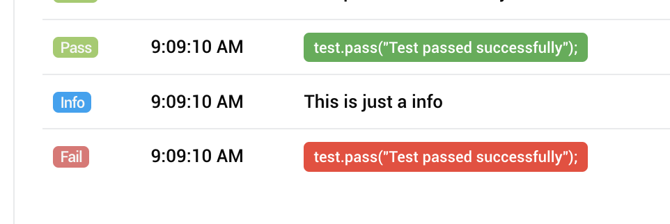
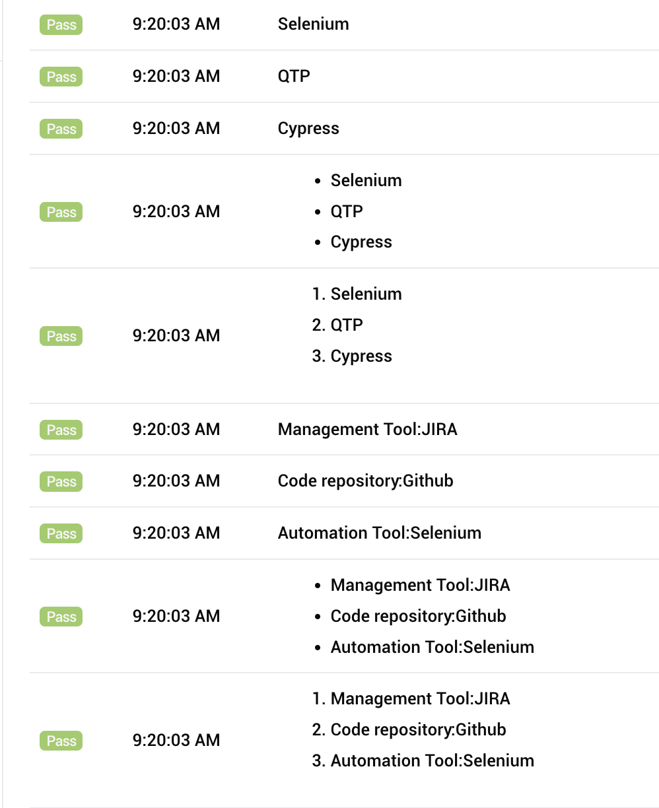
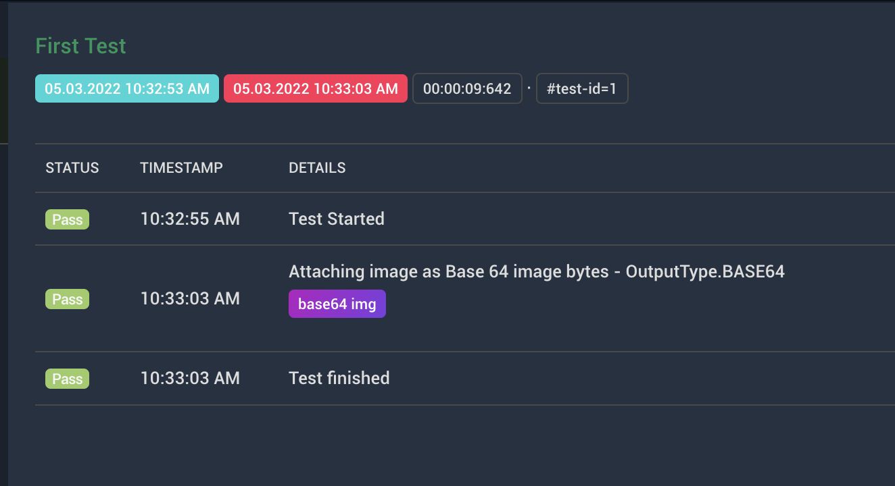

# Extent Reports example
```javas
	  ExtentReports extent = new ExtentReports();
	  ExtentSparkReporter spark = new ExtentSparkReporter("index.html");
	  
	  spark.config().setTheme(Theme.DARK);
	  spark.config().setDocumentTitle("Extent Report Example");
	  spark.config().setReportName("Report Name");
	  
	  extent.attachReporter(spark);
	  
	  //creates a test node
	  ExtentTest test =  extent.createTest("Login Tests").assignAuthor("Sriram K").assignCategory("Regression").assignDevice("Chrome"); 
	  test.pass("Test started successfully"); //step
	  test.pass("URl is loaded"); //step
	  test.pass("Value is entered"); //step
	  test.pass("Test passed successfully"); //step
	  test.info("This is just a info"); //info
	  test.skip("This is a skip"); //skip
	 
	  
	  //creates a new test node 2
	  ExtentTest test2 =  extent.createTest("Home page Tests").assignAuthor("Manju").assignCategory("Smoke").assignDevice("Firefox");
	  test2.pass("Test started successfully"); //step
	  test2.pass("URl is loaded"); //step
	  test2.pass("Value is entered"); //step
	  test2.fail("Home page test failed"); //step
```
 
 # How to fetch config from a JSON file

 ```java
	  ExtentReports extent = new ExtentReports();
	  ExtentSparkReporter spark = new ExtentSparkReporter("index.html");
	  
	  final File CONF = new File("extentConfig.json");
	  spark.loadJSONConfig(CONF);
 ```
 
  # How to fetch config from a XML file

 ```java
	  ExtentReports extent = new ExtentReports();
	  ExtentSparkReporter spark = new ExtentSparkReporter("index.html");
	  
	  final File CONF = new File("extentConfig.xml");
	  spark.loadXMLConfig(CONF);
 ```
  # How to generate report with only failed tests

  ```java
	  ExtentSparkReporter failedSpark = new ExtentSparkReporter("failed-tests-index.html")
										.filter()
										.statusFilter()
										.as(new Status [] {Status.FAIL} )
										.apply();
  ```
 
 # How to log JSON data in the report
 
 ```java
 String jsonCode = "{\n"
	  		+ "    \"data\": {\n"
	  		+ "        \"id\": 2,\n"
	  		+ "        \"email\": \"janet.weaver@reqres.in\",\n"
	  		+ "        \"first_name\": \"Janet\",\n"
	  		+ "        \"last_name\": \"Weaver\",\n"
	  		+ "        \"avatar\": \"https://reqres.in/img/faces/2-image.jpg\"\n"
	  		+ "    },\n"
	  		+ "    \"support\": {\n"
	  		+ "        \"url\": \"https://reqres.in/#support-heading\",\n"
	  		+ "        \"text\": \"To keep ReqRes free, contributions towards server costs are appreciated!\"\n"
	  		+ "    }\n"
	  		+ "}";
	  test.info(jsonCode); //normal log - doesnt look good
	  test.info("<pre>"+jsonCode.replace("\n", "<br>")+"</pre>"); //old work around - still not good looking
	  test.info(MarkupHelper.createCodeBlock(jsonCode,CodeLanguage.JSON)); // new way efficient
```

#How to change order of tabs in Report

```java
	  ExtentReports extent = new ExtentReports();
	  ExtentSparkReporter spark = new ExtentSparkReporter("index.html")
	  				.viewConfigurer()
	  				.viewOrder()
	  				.as(new ViewName[] {ViewName.DASHBOARD, ViewName.TEST, ViewName.CATEGORY} )
	  				.apply();
```

#How to change log statement background color in report
```java
test.pass(MarkupHelper.createLabel("test.pass(\"Test passed successfully\"); ",ExtentColor.GREEN));
test.fail(MarkupHelper.createLabel("test.pass(\"Test passed successfully\"); ",ExtentColor.RED));
```


#How to log list, map in the reports
```java
	//List
	test.pass(MarkupHelper.createUnorderedList(Arrays.asList(new String[]{"Selenium", "QTP", "Cypress"})).getMarkup());
	test.pass(MarkupHelper.createOrderedList(Arrays.asList(new String[]{"Selenium", "QTP", "Cypress"})).getMarkup());
	
	//Map
	Map<String,String> map=new HashMap<String,String>();
	map.put("Automation Tool", "Selenium");
	map.put("Code repository", "Github");
	map.put("Management Tool", "JIRA");
	map.forEach((k,v) -> test.pass(k +  ":" +v));
	test.pass(MarkupHelper.createUnorderedList(map).getMarkup());
	test.pass(MarkupHelper.createOrderedList(map).getMarkup());
```


#How to attach screenshot - embedd base 64 image in report
```java
test.pass("Attaching image as Base 64 image bytes - OutputType.BASE64",
	MediaEntityBuilder.createScreenCaptureFromBase64String(getScreenshotAsBase64()).build());

public String geBase64() throws IOException
{
	return ((TakesScreenshot)driver).getScreenshotAs(OutputType.BASE64);
}
```

